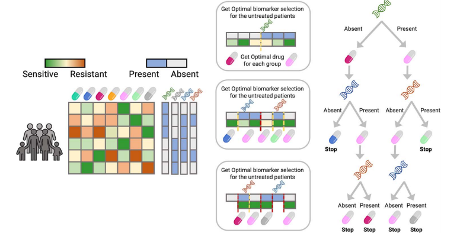

# Optimal Decision Tree (ODT) R package

The *ODT* R package implements the [Optimal Decision Tree (ODT) algorithm](https://doi.org/10.1093/bib/bbad200), a novel approach designed for the field of personalized medicine. This algorithm employs tree-based methods to recommend the most suitable treatment for each patient by considering their unique genomic and mutational data. 

Optimal Decision Trees iteratively refine drug recommendations along each branch until a predefined group size is achieved, ensuring that treatment suggestions are both personalized and statistically robust. This approach enhances decision-making in therapeutic contexts, allowing healthcare professionals to tailor interventions based on individual patient profiles.

# Installation

The *ODT* package can be easily installed from the Comprehensive R Archive Network (CRAN) repository. To install the package, you can use the following command in your R console:

`install.packages("ODT")`

# About

Unlike other personalized medicine algorithms that use classification or regression trees, *ODT* works by solving optimization problems. It takes into account how each patient responds to different drugs (sensitivity data) and their genomic or mutational information.

The algorithm selects a splitting variable, which could be a gene or a type of mutation, depending on the data being studied. For each split, *ODT* determines the best treatments and optimizes the measure of sensitivity for both branches based on these treatments (for example, using IC50 data). In other words, the algorithm assigns the best treatment to each patient by optimizing sensitivity data while creating an optimal decision tree.

The package consists of three main functions:

-   **Model Training** (**`trainTree`**): This function allows users to train the decision tree using the patients' genomic or mutational data (biomarker matrix) and the drug responses (sensitivity matrix).
-   **Optimal Treatment Assignment** (**`predictTree`**): After training the tree, this function predicts the optimal treatment for each patient based on their expression and/or mutational data.
-   **Decision Tree Visualization** (**`niceTree`**): This function generates a graphical representation of the decision tree splits. Users can also download this plot in various formats to a specified directory.

  
  
<strong>Figure 1. ODT Model Workflow.</strong>

As shown in Figure 1, the *ODT* model operates using two key inputs: the sensitivity matrix and the biomarker matrix. Initially, the model takes the biomarker data - which may consist of a binary matrix indicating the presence or absence of mutations, or a matrix reflecting gene expression levels - to train the decision tree.

At each step, the trained tree splits patients into two groups based on the presence or absence of specific biomarkers. This split is optimized to ensure that the assigned treatment has the highest sensitivity for each group. The algorithm continues to recursively divide the branches until a predefined minimum group size is reached, at which point further splits are no longer possible.

